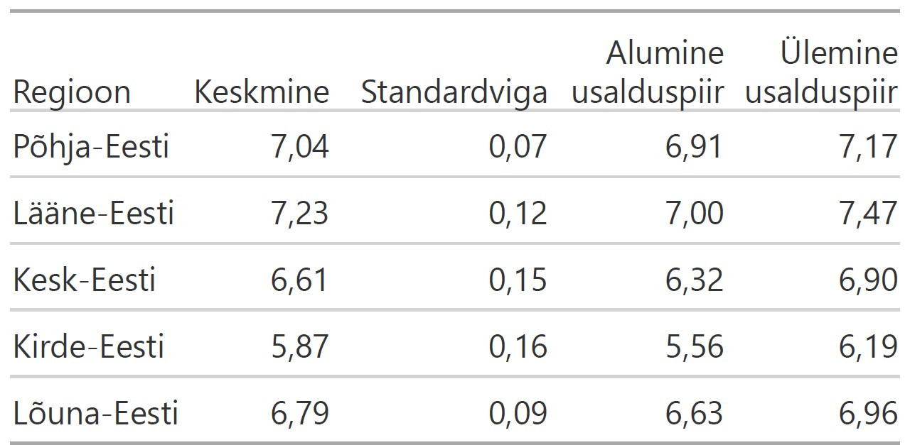
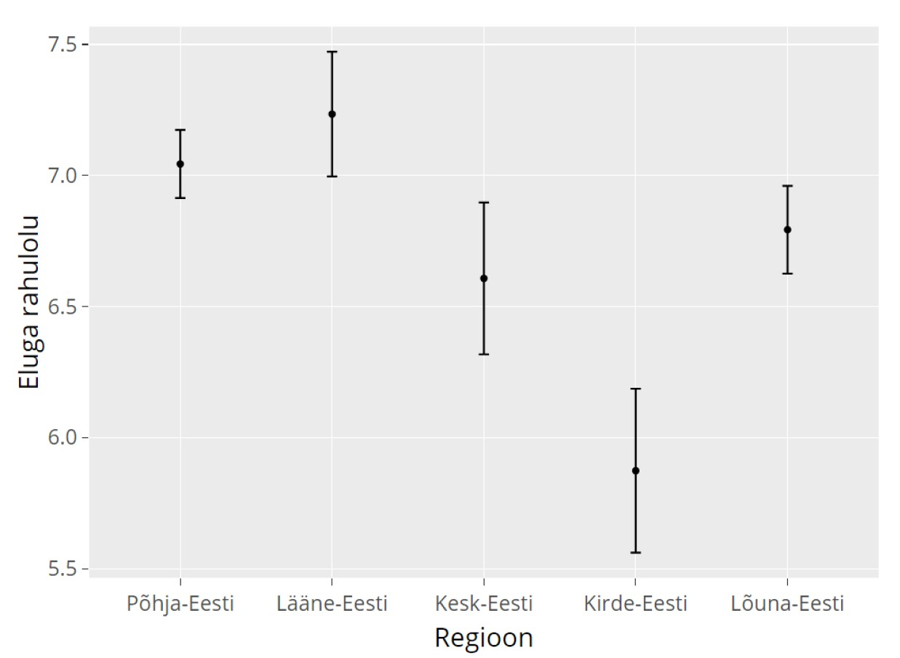
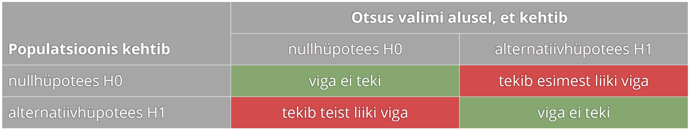
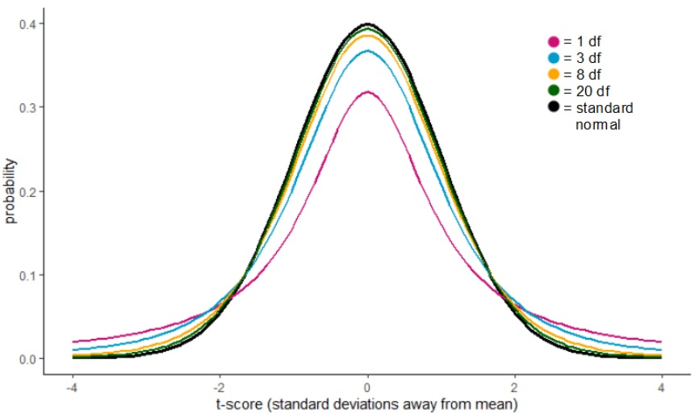
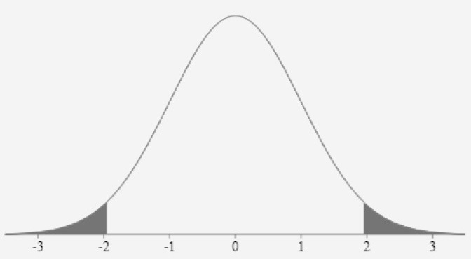
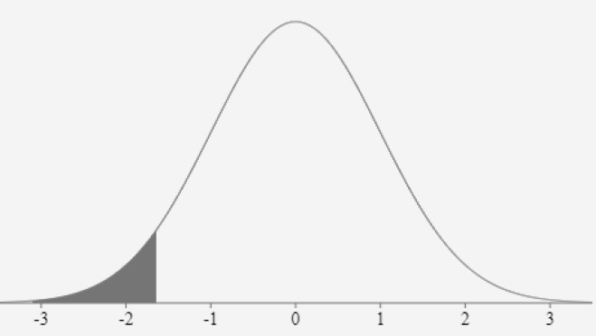
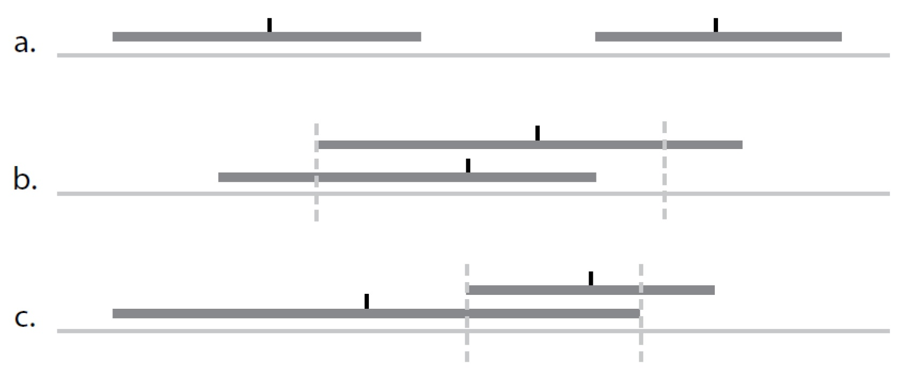

```{r setup, include=FALSE}
knitr::opts_chunk$set(echo = FALSE)
```

## Eelmine kord
:::: {style="display: flex;"}
:::{}
- Kas keskmine eluga rahulolu erineb Eestis regiooniti? 
- Andmed valimi kohta, tahtsime järeldusi teha populatsiooni
  kohta (rahvastiku tasandil)
- Arvutasime keskmistele usaldusvahemikud
- {width=50%}
- {width=50%}
- Usaldusnivool 95% saime öelda, et
:::
:::{}
- eluga rahulolu alusel eristuvad kolm regioonide rühma
- Põhja- ja Lääne-Eestis oli eluga rahulolu keskmine üle 7 või 7
 piirimail
- Kesk- ja Lõuna-Eestis jäi eluga rahulolu keskmine alla 7 palli
- Kirde-Eestis oli eluga rahulolu teistest regioonidest madalam ja
 keskmine jäi alla 6,2 palli
- Kas keskmine eluga rahulolu Põhja-Eestis ja Lõuna-Eestis erineb?
- Usaldusnivool 95% usaldusvahemikud kattuvad, kuigi vähesel määral
- Antud usaldusvahemike võrdlemisel seda väita ei saa
- Kui usaldusvahemikud mingil määral kattuvad, siis keskmiste
  erinevuse osas saaks täpsema järelduse statistilise testi põhjal, mis
  testib keskmiste erinevust
- Teeme läbi hüpoteeside testimise t-testi põhjal
:::
::::

## Hüpoteeside testimine

- Statistiline hüpotees
   - oletus üldkogumi (nt selle jaotuse või parameetri) kohta,
   - mida testitakse valimiandmete alusel
- Kontrollime / testime hüpoteesi, et Põhja- ja Lõuna-Eestis keskmine eluga rahulolu
  erineb
- Milles on hüpoteeside testimise iva?
  - Meil on olemas ainult valimiandmed, nende põhjal näeme, et Põhja- ja Lõuna-Eestis on eluga rahulolu keskmiselt mõnevõrra erinev (7,04 vs 6,79)
  - Kas me saame öelda, et keskmiste erinevus esineb ka populatsioonis?
  - Või on populatsioonis need keskmised tegelikult võrdsed?
  - Me ei tea seda, sest valim ei pruugi olla täiesti täpne koopia populatsioonist
  - Eeldusel, et meie valim on tõenäosuslik (st juhuvalim), saame hinnata, kas võib väita keskmiste erinevust ka populatsioonis
- Selleks peame esmalt sõnastama alternatiivhüpoteesi ja nullhüpoteesi

## Hüpoteeside testimine
- Alternatiivhüpotees (H1) – reeglina sõnastatud nii, et väidab erinevuse esinemist / seose
  kehtimist
- Nullhüpotees (H0) – vastupidine sellele
- Praegusel juhul:
    - H1: Põhja- ja Lõuna-Eestis keskmine eluga rahulolu erineb ($m_p \neq m_l$)
    - H0: Põhja- ja Lõuna-Eestis keskmine eluga rahulolu ei erine ($m_p = m_l$)
- Hüpoteesipaari sõnastamisel on oluline, et hüpoteesid
    - välistaksid teineteist
         -   nt ei saa olla, et H1: $m_p \geq m_l$ ja H0: $m_p \leq m_l$
    - kataksid kõik võimalikud stsenaariumid
         -   nt ei saa olla, et H1: $m_p \geq m_l$ ja H0: $m_p = m_l$
- NB! Hüpoteesides ei pruugi olla öeldud, et need käivad populatsiooni kohta, aga meeles tuleb
  pidada, et tegu on statistiliste hüpoteesidega

## Hüpoteeside testimine
- Praegusel juhul:
    - H1: Põhja- ja Lõuna-Eestis keskmine eluga rahulolu erineb ($m_p \neq m_l$)
    - H0: Põhja- ja Lõuna-Eestis keskmine eluga rahulolu ei erine ($m_p = m_l$)
- Tegu on kahepoolse hüpoteesipaariga – H1 seondub arvtelje kahe lõiguga
- Hüpoteesipaar (täpsemalt, alternatiivhüpotees) võib olla ka ühepoolne
- Sel juhul seondub H1 arvtelje ühe lõiguga, hüpoteesipaar võib olla 
    - H1: $m_p < m_l$ ja H0: $m_p \geq m_l$  või
    - H1: $m_p > m_l$ ja H0: $m_p \leq m_l$
- Võimalik ühepoolne hüpoteesipaar lahti sõnastatult meie näite puhul
    - H1: Põhja-Eestis on keskmine eluga rahulolu kõrgem, kui Lõuna-Eestis ($m_p > m_l$)
    - H0: Põhja-Eesti keskmine eluga rahulolu ei ole kõrgem kui Lõuna-Eestis ($m_p \leq m_l$)

## Esimest ja teist liiki viga
- Hüpoteesipaari testitakse statistilise testi põhjal, valimiandmete alusel
- Kaks võimalikku otsust: kas
    - võtame vastu alternatiivhüpoteesi või
    - jääme nullhüpoteesi juurde
- Juhuvalim võib juhuslikkuse tõttu mõnevõrra populatsioonist erineda
- Seetõttu eksisteerib võimalus, et teeme valimi alusel populatsiooni kohta eksliku otsuse
- Esimest liiki viga – populatsioonis kehtib H0 (erinevust ei esine), aga jõuame valimiandmete
  põhjal järeldusele, et kehtib H1 (keskmiste erinevus)
- Kuigi juhuvalik võimaldab saada valimi, mis on populatsioonile võimalikult sarnane, võib ikkagi mõningatel juhtudel valim juhuse tõttu populatsioonist niivõrd palju erineda, et jõuame eksliku järelduseni
    - Millisel juhul teeksime 1. liiki vea oma hüpoteesipaari puhul?
- Teist liiki viga – populatsioonis kehtib H1 (erinevus esineb), aga jõuame valimiandmete põhjal
  järeldusele, et kehtib H0 (erinevust ei esine)
    - Millisel juhul teeksime 2. liiki vea oma hüpoteesipaari puhul?

## Esimest ja teist liiki viga
- {width=95%}
- Esimest liiki vea võimaluse vähendamine kriitilisema tähtsusega
- Nt mõõdame silla tugevust, viime läbi hulga katseid juhuslikes kohtades silla
  kandekonstruktsioonis
    - H0: sild ei ole piisavalt vastupidav
    - H1: sild on piisavalt vastupidav
- Hüpoteesipaar sõnastatakse reeglina nii, et esimest liiki veast tulenev probleem suurem (tahame
  eelkõige vältida selle vea tegemist) =>
    - nullhüpotees väidab soovitule (sellele, mis meid huvitab) vastupidist

## Esimest ja teist liiki viga
- {width=95%}
- Hüpoteesipaari sõnastamisel võidakse lähtuda ka traditsioonist
  - Nullhüpotees väidab võrdumist, seose puudumist
  - Alternatiivhüpotees väidab erinevust, seose esinemist
- Enamasti ka statistilised testid üles ehitatud sellel põhimõttel

## Esimest ja teist liiki viga
- {width=95%}
- Hüpoteeside testimise loogika: me ei tea, kas populatsioonis kehtib H0 või H1
- Püüame jõuda tõele jälile, keskendudes mitte sellele, kas kehtib H1, vaid sellele, kas kehtib H0
- Kui H0 ei kehti, saame järeldada, et kehtib H1, sest H0 ja H1 välistavad teineteise
- Seejuures prioriteet on vältida esimest liiki viga (ka teist liiki viga oleks halb, aga esimest liiki vea vältimine olulisem)

## Esimest ja teist liiki viga
- {width=95%}
- Analoogia: kohtuprotsess nullhüpoteesi üle
- Meie oleme süüdistajad, kes püüavad näidata, et H0 on süüdi (et populatsioonis H0 ei kehti)
- Tõendusmaterjal: valimiandmed, statistiline test
- Kehtib süütuse presumptsioon: nullhüpotees on süütu kuniks meil ei õnnestu mõistliku kahtluseta tõendada vastupidist
- William Blackstone: *On parem, et kümme süüdlast pääsevad, kui et üks süütu kannatab.*
- Oluline vältida süütu süüdimõistmist (esimest liiki viga)

## Esimest ja teist liiki viga
- {width=95%}
- Oluline vältida süütu süüdimõistmist (esimest liiki viga)
- Esimest liiki vea suurust mõõdetakse tõenäosusega saada valimiandmeid, mis selle veani viiksid
  - Tõenäosusega, et juhuvaliku alusel saadav valim erineb populatsioonist niivõrd, et viib hüpoteesipaari suhtes eksliku
otsuseni
- Hüpoteeside testimisel määratakse eelnevalt kindlaks esimest liiki vea lubatav ülempiir $\alpha$
  - Seda nimetatakse olulisuse nivooks
  - Tavaliselt 0,05, rangem 0,01 või 0,001, leebem 0,1
- H0 õnnestub kummutada, kui esimest liiki vea tegemise võimalus on väiksem olulisuse nivoost
- St nullhüpotees mõistetakse süüdi, kui võimalus eksida (süütu süüdi mõista) on piisavalt väike

## Hakkame testima – kuidas?
- Niisiis, hüpoteesipaari testitakse valimiandmete alusel, otsus tehakse populatsiooni kohta
- Keskmised ja nende erinevuse arvutame valimi alusel, aga mille alusel teha otsus populatsiooni
  kohta?
- Selleks ongi statistiline test – võimaldab hinnata erinevuse / seose esinemist populatsioonis

## Valime statistilise testi 
- Aritmeetiliste keskmiste võrdlemiseks: t-test
- Sõltumatute kogumite t-test: võrdleme arvulise tunnuse keskmisi kategoriseeriva tunnuse
  lõikes
$$t = \frac{m_1 - m_2}{s} \sqrt{\frac{n_1n_2}{n_1+n_2}}$$
- $m_1, m_2$ – arvulise tunnuse keskmised kogumites
- $s_1^2, s_2^2$ – arvulise tunnuse dispersioonid kogumites
- $s$ – kahe kogumi ühise standardhälbe hinnang
- $n_1, n_2$ – indiviidide arvud kogumites

## Sõltumatute kogumite t-test
- Aritmeetiliste keskmiste võrdlemiseks: t-test
- Sõltumatute kogumite t-test: võrdleme arvulise tunnuse keskmisi kategoriseeriva tunnuse
  lõikes
$$t = \frac{m_1 - m_2}{s} \sqrt{\frac{n_1n_2}{n_1+n_2}}$$
- Eeldused:
    - Arvulise tunnuse jaotus gruppide lõikes normaaljaotuse lähedane
    - Arvulise tunnuse hajuvus gruppide lõikes sarnane
        - kui ei ole => Welchi t-test
$$t = \frac{m_1 - m_2}{\sqrt{\frac{s_1^2}{n_1}+\frac{s_2^2}{n_2}}}$$

## Arvutame teststatistiku

- Kui kasutame *t*-testi, nimetatakse teststatistikut *t*-statistikuks (*t* väärtus valemis)
$$t = \frac{m_1 - m_2}{s} \sqrt{\frac{n_1n_2}{n_1+n_2}} = \frac{0.25}{1.94}\cdot{18.09} = 2.33$$

- Saime teada *t* väärtuse, aga kuidas saame selle alusel midagi öelda populatsiooni
  kohta või teha järelduse hüpoteesipaari kohta?

## Teeme järelduse populatsiooni osas
:::: {style="display: flex;"}
:::{}
- Võtame appi *t*-jaotuse
- Analoogne usaldusvahemiku mõtteharjutusega
     -   Olgu meil populatsioon, kus kehtib H0 (keskmiste erinevust pole)
     -   Kui võtaksime sellest populatsioonist palju valimeid,
     -   mõõdaksime samu tunnuseid ja arvutaksime iga valimi andmete alusel *t*-statistikud, siis
     -   jaotuksid saadud *t*-statistikud *t*-jaotuse kohaselt
     -   indiviidide suure arvu korral ühtib *t*-jaotus normaaljaotusega, seega
     -   sajast valimist
           -   10 valimis $t > 1.64$ või $t < -1.64$
           -   5 valimis $t > 1.96$ või $t < -1.96$
           -   1 valimis $t > 2.58$ või $t < -2.58$
:::
:::{}
- Eelnevaid piire nimetatakse *t*-statistiku kriitilisteks väärtusteks
- *t*-statistiku kriitiliseks piirkonnaks nimetatakse
     - *t* positiivsest kriitilisest väärtusest suuremate väärtuste piirkonda ja
     - *t* negatiivsest kriitilisest väärtusest väiksemate väärtuste piirkonda
- Reaalne olukord: me ei tea, kas populatsioonis kehtib H0 või H1; meil on ainult üks valim
- Hüpoteesipaari kohta otsuse tegemise loogika:
  - Kui valimi alusel saadud *t*-statistik asub kriitilises piirkonnas, saame H0 kummutada ja kinnitada H1
- Miks?
:::
::::

## Teeme järelduse populatsiooni osas
:::: {style="display: flex;"}
:::{}
- Tuletame meelde: olulisuse nivoo – esimest liiki vea lubatav ülempiir
    - Olulisuse nivool 0,05 on (indiviidide suure arvu korral) *t*-statistiku kriitilised väärtused $t_{1-\frac{\alpha}{2}} = 1.96$ ja $t_{\frac{\alpha}{2}} = -1.96$
    - See tähendab, et kui võtaksime populatsioonist, kus kehtib H0 (keskmiste erinevust pole) 100 valimit, siis
    - viies neist saaksime *t* väärtuse, mille absoluutväärtus on suurem 1,96-st
- Reaalsuses saame võtta ühe valimi
- Me ei tea, kas populatsioonis kehtib H0 või H1
- Kui populatsioonis kehtib H0, siis tõenäosus, et saaksime valimi, kus *t* absoluutväärtus on
  üle 1,96, on väga väike (5%)
:::
:::{}
- St et kui *t* väärtus on piisavalt suur, st üle kriitilise piiri,
    -   siis võime eeldada, et on kogunenud piisavalt tõendusmaterjali, et
    -   n-ö nullhüpoteesi süüdimõistmisel (väites, et H0 ei kehti), mitte eksida (mitte teha esimest liiki viga) –
    -   saame kinnitada alternatiivhüpoteesi
- Oluline siiski mõista, et otsus on tingimuslik
    - põhimõtteliselt on võimalik ka populatsioonist, kus kehtib H0, saada valim, kus $|t| > 1.96$ (kuigi see võimalus
      on väike)
- Kui vajame suuremat kindlust, et me otsuse tegemisel ei tee esimest liiki viga, siis võime võtta rangema olulisuse nivoo
  - Nt olulisuse nivool 0,01 => $t_{1-\frac{\alpha}{2}} = 2.58$ ja $t_{\frac{\alpha}{2}} = -2.58$
:::
::::

## Olulisuse nivoo ja usaldusnivoo
- Mille poolest sarnanevad / erinevad?
- Sama mündi kaks poolt
- Hüpoteeside testimisel võtame aluseks olulisuse nivoo (0,5 või 0,1 või 0,01)
- Usaldusvahemiku arvutamisel usaldusnivoo (95% või 90% või 99%)
- Nii olulisuse nivoo 0,05 (ehk 5%) kui usaldusnivoo 95% puhul võetakse arvutuste aluseks
väärtused 1,96 ja 1,96
- Miks siis kaks erinevat mõistet?
- Usaldusvahemiku puhul huvitab meid see, mis jääb nende väärtuste alusel arvutatavate piiride
(usalduspiiride) *vahele*
  - Vahemik, mis *katab* tegeliku väärtuse populatsioonis
- Hüpoteeside testimisel huvitab meid see, kas teststatistik jääb nende väärtuste alusel
arvutatavatest piiridest (kriitilistest väärtustest) *väljapoole*
  - Kui jääb, saame kinnitada alternatiivhüpoteesi

## Kriitilised väärtused sõltuvad vabadusastmete arvust
:::: {style="display: flex;"}
:::{}
- Eelnevalt *t*-statistiku puhul välja toodud kriitilised piirid on täpsed eeldusel, et
  indiviide on palju
- Kui indiviide on vähe, ei lange *t*-jaotus täpselt kokku
  normaaljaotusega
- Täpsemalt: *t*-statistikud jaotuvad *t*-jaotuse kohaselt
  vabadusastmete arvu $n - 1$ korral
- {width=50%}
- Vabadusastmete arv *(degrees of freedom)* – väljendab tõsiasja, et kui arvutame *t*-statistikut, siis meil on andmed $n$ indiviidi kohta, kuid ka teatud piirangud
:::
:::{}
- Sisuline tähtsus on selles, et sõltuvalt
  vabadusastmete arvust (indiviidide arvust) on *t*-jaotus mõnevõrra erineva kujuga =>
    - $t$ kriitilised väärtused mõnevõrra erinevad
- Nt olulisuse nivool 0,05
    - kui $df = n -  1 = 80$, siis $t_{1-\frac{\alpha}{2}} = 1.99$ ja $t_{\frac{\alpha}{2}} = -1.99$
    - kui $df = n -  1 = 30$, siis $t_{1-\frac{\alpha}{2}} = 2.04$ ja $t_{\frac{\alpha}{2}} = -2.04$
    - kui $df = n -  1 = 8$, siis $t_{1-\frac{\alpha}{2}} = 2.31$ ja $t_{\frac{\alpha}{2}} = -2.31$
:::
::::

## Olulisuse tõenäosus
- Kas peame erinevad *t* väärtused meeles pidama?
- Ei pea, ei pea ka kuskilt üles otsima
- Kui andmeanalüüsiprogramm arvutab *t* väärtuse, annab ka olulisuse tõenäosuse (*p*-väärtus) vastava
  vabadusastmete arvu juures
- Mis see olulisuse tõenäosus õigupoolest on?
- "Tõenäosus teha esimest liiki viga" laias laastus pole otseselt vale, aga pole päris täpne
- Korrektne: tõenäosus saada nullhüpoteesi kehtimise korral vastav või sellest veel suurem
teststatistiku väärtus
- Täpsemalt: tõenäosus saada populatsioonist, kus kehtib H0, valimiandmed, mille põhjal
saaksime vähemalt nii suure teststatistiku väärtuse

## Olulisuse tõenäosus
- Meie näites $t = 2.33, \ df = 1384$, siis $p = 0.02$
- Kui populatsioonis kehtib H0 ehk kahe kogumi keskmised ei erine, siis tõenäosus saada
populatsioonist juhuvalikuga valim, kus nende kahe kogumi keskmiste alusel arvutatav *t*-statistik
on 2,33 või sellest suurem, on 0,02 ehk 2% ehk kaks sajast
- Kui olulisuse tõenäosus < olulisuse nivoo, tuleb kummutada / tagasi lükata nullhüpotees ja vastu võtta /
  kinnitada alternatiivhüpotees
    - Saame öelda, et keskmiste erinevus on *statistiliselt oluline* vastaval olulisuse nivool
- Kui olulisuse tõenäosus $\geq$ olulisuse nivoo, ei saa kinnitada alternatiivhüpoteesi, tuleb jääda nullhüpoteesi
  juurde
- NB! Nullhüpoteesi ei saa kinnitada / tõestada – kui ei õnnestu kinnitada alternatiivhüpoteesi, tuleb jääda
  nullhüpoteesi juurde
    - Me ei saa öelda, et nullhüpotees tingimata kehtib, meil lihtsalt ei õnnestunud leida tõendust vastupidisele
    - Meil ei ole piisavalt tõendeid, et nullhüpoteesi n ö süüdi mõista, aga see ei tähenda, et saame kinnitada
nullhüpoteesi süütust

## Tulemuste esitamine

- Võib tunduda, et järelduste tegemiseks polegi vaja muud, kui vaadata olulisuse
  tõenäosust ja raporteerida see
- Päris nii see pole
- Olulisuse tõenäosus (nagu ka usaldusvahemik) käib alati konkreetse näitaja kohta
- Raporteerida tuleks ka see näitaja (teststatistik) ja selle tõlgendamiseks vajalikud näitajad
- Seega, t-testi tulemuste põhjal saame olulisuse nivool 0,05 väita, et 2016. aastal
  keskmine eluga rahulolu Põhja- ja Lõuna-Eestis erines ($t = 2.33, \ df = 1384, \ p = 0.02$)
- Või: …erines (t-statistiku väärtus 2,33, vabadusastmete arv 1384, olulisuse tõenäosus
  0,02)

## Aga kui meil on ühepoolne hüpoteesipaar?
- Eelnev arutelu ja näide põhinesid kahepoolse hüpoteesipaari testimisel
    - H1: Põhja- ja Lõuna-Eestis keskmine eluga rahulolu erineb ($m_p \neq m_l$)
    - H0: Põhja- ja Lõuna-Eestis keskmine eluga rahulolu ei erine ($m_p = m_l$)
- Kui hüpoteesipaar on ühepoolne, tuleb
    - teststatistiku kriitilised väärtused arvutada natuke teisel põhimõttel

:::: {style="display: flex;"}
:::{}
- Kahepoolne hüpoteesipaar: kriitilised piirkonnad asuvad *t*-jaotuse mõlema „saba“ all
- {width=75%}
:::
:::{}
- Ühepoolne hüpoteesipaar: kriitiline piirkond asub *t*-jaotuse selle "saba" all, mida väidab H1
- Nt kui hüpoteesipaar on H1: $m_p < m_l$ ja H0: $m_p \geq m_l$, siis kriitiline piirkond:
- {width=75%}
:::
::::

## Keskmiste usaldusvahemikud vs *t*-test

- Keskmiste usaldusvahemike osalisel kattumisel võivad keskmised siiski statistiliselt
  oluliselt erineda
```{r fig.cap = "Tooding (2015: 165)", fig.align = "center", out.width = "80%"}

```
  
- $a.$ Saab erinevust väita
- $b.$ Erinevust ei saa väita
- $c.$ Kontrolli keskmiste erinevust *t*-testi alusel

## Ühe kogumi *t*-test

- Põhimõte sarnane sõltumatute kogumite (kahe kogumi) *t*-testile
- Ühe valimi alusel mõõdetud kogumi keskmise asemel on mingi kindel väärtus
- Testime, kas valimi alusel arvutatud keskmine sellest erineb
- Nt kui tahame teada, kas valimi alusel saab väita, et Eesti elanike keskmine eluga
  rahulolu on üle skaala keskpunkti
   - H1: $m > 5$
   - H0: $m \leq 5$

## Paariskogumite *t*-test

- Kasutatakse, kui vaatlused on omavahel seotud
- St me ei võrdle kahe erineva grupi keskmisi, vaid samade indiviidide keskmisi, mis nt
   - on mõõdetud erinevatel ajahetkedel
       - nt samade indiviidide rahulolu eluga enne ja majanduskriisi ajal
   - mõõdavad erinevaid nähtusi
       - nt samade indiviidide rahulolu majanduse olukorraga ja valitsuse tegevusega